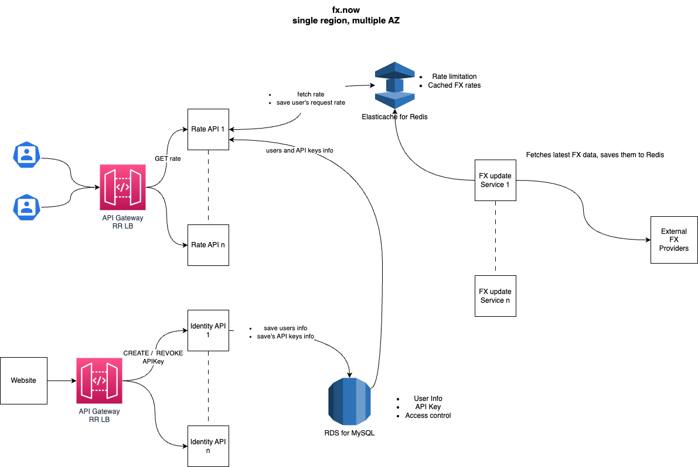

## fx.now
This is a project aimed to provide the latest Forex data for the most common fiat pairs as a free / low-cost fast
and highly available  service.
<br/>The main goal in building this is to get familiar with the issues and hurdles of designing, implementing and deploying
an open-source cloud-based public service.

### System design


With this design, I am trying to produce a fast and highly available service by also taking into consideration a
limited budget.

### API
Backend services are deployed on AWS their APIs are reachable at [fx-now.com](https://fx-now.com).

To get access to Forex data you first need to obtain an API key. To do that, access with your google account at
<br/>`https://fx-now.com/identity/access`. This will set a cookie for the domain "fx-now.com". With this cookie set,
make a POST request like
```
curl --location --request POST 'https://fx-now.com/identity/v1/api-key' \
--header 'Cookie: access_token={your_access_token}'
```
This will return an API key you can use to fetch forex data though the `/rate` API. For example, if you want to fetch
data for the USD-JPY pair, run:
```
curl --location 'https://fx-now.com/fxrate/v1/rate?pairs=USD_JPY&api-key={your_api_key}'
```

Most Forex pairs are already available. Cryptocurrencies will be enabled in the future.

### Status
This project is still very much in progress :)
<br/>I am contributing to it during my spare time.